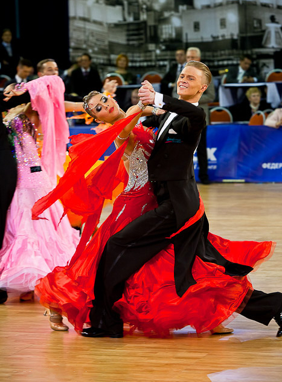

---
title: "Taniec towarzyski"
author: "Natalia Kowalska"
date: "Maj 19.05.18r."
output:
  rmarkdown::html_document:
    df_print: paged
    theme: united
    highlight: tango
---

```{r setup, include=FALSE}
knitr::opts_chunk$set(echo = TRUE)
```

Taniec towarzyski (z ³ac.ballare, t³um. do tañca) – forma rozrywki wywodz¹ca siê z tañców salonowych i zabaw ludowych, uprawiana od pocz¹tku XX wieku, na pocz¹tku by³ to taniec dla klas uprzywilejowanych, natomiast tañce ludowe pozostawiano klasom ni¿szym. Dziêki muzyce jazz, która sta³a siê bardzo popularna w latach 20., dosz³o do wybuchu nowo wynalezionych tañców. Poszczególne tañce ró¿ni¹ siê pochodzeniem, charakterem, schematem ruchów, ubiorem i muzyk¹. Jest to zestaw tañców partnerskich, od kilkunastu lat cieszy siê popularnoœci¹ równie¿ w Polsce.


### Œwiatowe turnieje tañca towarzyskiego

1. Blackpool Dance Festival
2. Asian Open Festival
3. City Lights Ball
4. Kreml Cup
5. IBDF
6. WDSF (dawniej IDSF)
7. Copenhagen Open
8. Dance Masters
9. Grand Prix Rimini
10. Supadance Polish Open Championships
11. UK Open

### Tañce turniejowe

- walc angielski
- tango (dawniej taniec latynoamerykañki)
- walc wiedeñski
- foxtrot
- quickstep
- samba 
- cha-cha
- samba
- rumba
- pasodoble 
- jive

### Tañce u¿ytkowe

|american smooth|charleston|rock and roll|bachata|
|:------:|:-----:|:---------:|:------:|
|    conga        | salsa      | beguine       |  country-dance|
|   shimmy        |  blues rock|    Lambeth walk   |slow-fox  |
|  boogie  |  madison |   tango argentyñskie   |boogie-woogie  |
| mambo  |  twist | boston   |  merengue|
| two-step |  calypso | one-step | swing |
| carioca  |  polka czeska |  kizomba  | reggaeton |

#### [Przyk³adowy pokaz turniejowy](https://www.youtube.com/watch?v=34vrzq0yizQ)




```{r}
mtcars
```

```{r message=TRUE, warning=TRUE, paged.print=TRUE}
library(ggplot2)
ggplot(data = mpg) +
  geom_bar(mapping = aes(x = class, fill= class)) +
  labs(title = "iloœæ samochodów w poszczególnych klasach", x = "Klasy", y = "Iloœæ") +
  theme_minimal()
```

```{r message=TRUE, warning=TRUE, include=FALSE, paged.print=TRUE}
library(ggplot2)
ggplot(data = mpg) + 
  geom_histogram(mapping = aes(displ), bins = 10) +
  labs(title = "RozkÅ‚ad pojemnoÅ›ci silnika samochodów", x = "Pojemnoœæ", y = "Iloœæ samochodów")
```

```{r}
kwartal_1<- c("styczen", "luty", "marzec")
kwartal_2<- c("kwiecien", "maj", "czerwiec")
kwartal_3<- c("lipiec", "sierpien", "wrzesien")
kwartal_4<- c("pazdziernik", "listopad", "grudzien")
rok<- c(kwartal_1, kwartal_2, kwartal_3, kwartal_4)
rok[1:12]
rok[c(1, 2)]  

```

```{r}
ggplot(data = mpg, aes(x = class, y = displ)) +
  geom_boxplot() +
  coord_flip() +
  labs (title = "Samochody", x = "klasa", y = "pojemnoϾ")
```
