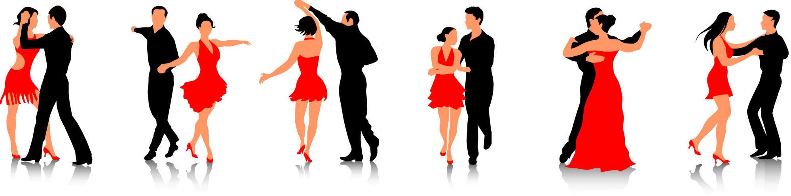

---
title: "Taniec towarzyski"
author: "Natalia Kowalska"
date: "Maj 19.05.18r."
output:
  html_document:
    df_print: paged
    theme: united
    highlight: tango
    
    
---

Taniec towarzyski (z łac.ballare, tłum. do tańca) – forma rozrywki wywodząca się z tańców salonowych i zabaw ludowych, uprawiana od początku XX wieku, na początku był to taniec dla klas uprzywilejowanych, natomiast tańce ludowe pozostawiano klasom niższym. Dzięki muzyce jazz, która stała się bardzo popularna w latach 20., doszło do wybuchu nowo wynalezionych tańców. Poszczególne tańce różnią się pochodzeniem, charakterem, schematem ruchów, ubiorem i muzyką. Jest to zestaw tańców partnerskich, od kilkunastu lat cieszy się popularnością również w Polsce.



### Światowe Turnieje Tańca Towarzyskiego

1. Blackpool Dance Festival
2. Asian Open Festival
3. City Lights Ball
4. Kreml Cup
5. IBDF
6. WDSF (dawniej IDSF)
7. Copenhagen Open
8. Dance Masters
9. Grand Prix Rimini
10. Supadance Polish Open Championships
11. UK Open

### Tańce turniejowe

- walc angielski
- tango (dawniej taniec latynoamerykański)
- walc wiedeński
- foxtrot
- quickstep
- samba 
- cha-cha
- samba
- rumba
- pasodoble 
- jive

### Tańce użytkowe

|american smooth|charleston|rock and roll|bachata|
|:------:|:-----:|:---------:|:------:|
|    conga        | salsa      | beguine       |  country-dance|
|   shimmy        |  blues rock|    Lambeth walk   |slow-fox  |
|  boogie  |  madison |   tango argentyńskie   |boogie-woogie  |
| mambo  |  twist | boston   |  merengue|
| two-step |  calypso | one-step | swing |
| carioca  |  polka czeska |  kizomba  | reggaeton |

#### [Przykładowy pokaz turniejowy](https://www.youtube.com/watch?v=34vrzq0yizQ)


```{r}
mtcars
```

```{r message=TRUE, warning=TRUE, paged.print=TRUE}
library(ggplot2)
ggplot(data = mpg) +
  geom_bar(mapping = aes(x = class, fill= class)) +
  labs(title = "ilość samochodów w poszczególnych klasach", x = "Klasy", y = "Ilość") +
  theme_minimal()
```

```{r message=TRUE, warning=TRUE, include=FALSE, paged.print=TRUE}
library(ggplot2)
ggplot(data = mpg) + 
  geom_histogram(mapping = aes(displ), bins = 10) +
  labs(title = "Rozkład pojemności silnika samochodów", x = "Pojemność", y = "Ilość samochodów")
```

```{r}
kwartal_1<- c("styczen", "luty", "marzec")
kwartal_2<- c("kwiecien", "maj", "czerwiec")
kwartal_3<- c("lipiec", "sierpie?", "wrzesien")
kwartal_4<- c("pazdziernik", "listopad", "grudzien")
rok<- c(kwartal_1, kwartal_2, kwartal_3, kwartal_4)
rok[1:12]
rok[c(1, 2)]  

```

```{r}
ggplot(data = mpg, aes(x = class, y = displ)) +
  geom_boxplot() +
  coord_flip() +
  labs (title = "Samochody", x = "klasa", y = "pojemność")
```
